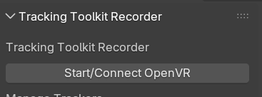
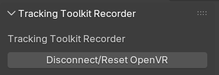
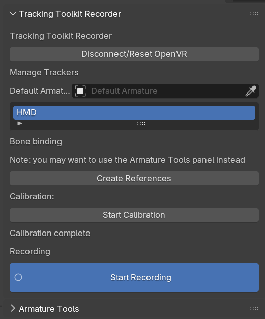
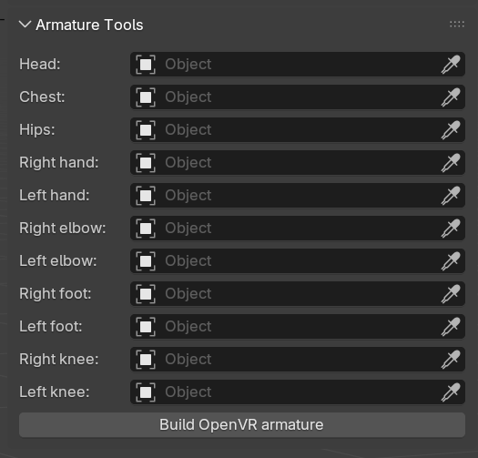
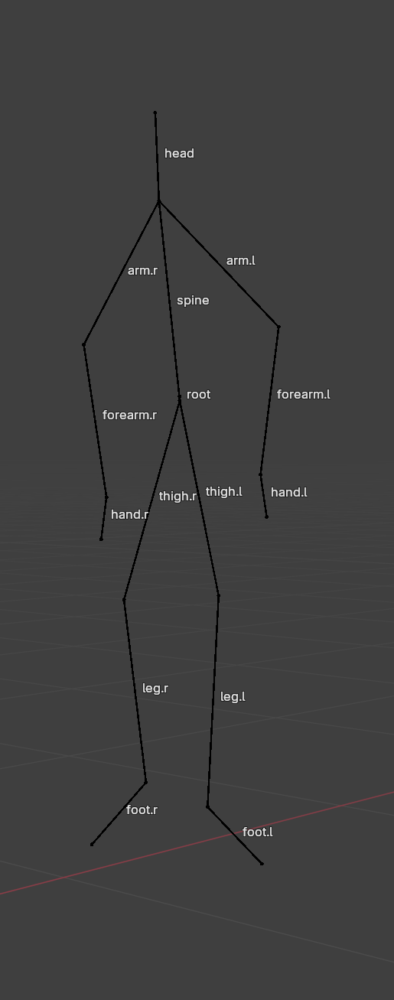

# Usage Guide

Here is a step-by-step guide for the majority of use-cases.

## Installation

Tracking Toolkit can be installed in one of two ways:

### Automatic

Drag this image onto the Blender interface. If it asks to create a repo, accept, and you may have to drag the image again. 

If you are updating, you can drag the image or check for updates in the Blender preferences.

[](https://github.com/ethanporcaro/tracking-toolkit/releases/latest/download/tracking_toolkit-latest.zip?repository=https%3A%2F%2Fgithub.com%2Fethanporcaro%2Ftracking-toolkit%2Freleases%2Flatest%2Fdownload%2Frepository.json&blender_version_min=4.2.0&platforms=windows-x64%2clinux-x64)

### Manual

1) Download `tracking_toolkit-latest.zip` from the [latest release](https://github.com/ethanporcaro/tracking-toolkit/releases/latest)
2) Open Blender, use `Edit > Preferences > Get Extensions > (Arrow in top right corner) > Install from disk`, and select the downloaded zip.

After enabling the extension, you will find a new panel in the sidebar tabs.

> ⚠️ SteamVR errors or crashes may also crash Tracking Toolkit, which may crash Blender.
> I do my best to handle these, but sometimes there are quirks I cannot completely avoid.
> Blender disables extensions that crash before a full Blender restart.

## Entering VR

✅ **Run these steps each time you open or restart SteamVR**

Begin by clicking the `Start/Connect OpenVR` button. 

[](images/start_openvr.png)

This will open SteamVR if it isn't open already, but I recommend starting SteamVR first.

> ⚠️ If the button shows `Disconnect/Reset OpenVR`, and SteamVR is **not** running, it probably means you exited Blender without pressing the disconnect button.
You can just press the button to reset the status, then click `Start/Connect` again.
>
> [](images/disconnect_openvr.png)

After connecting OpenVR, you should see the serial numbers of the trackers populated in a dropdown.
The rest of the Tracking Toolkit menu will also appear.

[](images/ttk_panel.png)

At this point, you are now ready to record.

## Recording Setup

✅ **Run these steps every time you open up a new Blender file.**

There are a few main buttons on the Tracking Toolkit panel:

### Create References

Pressing `Create References` will create two Blender objects for each tracked device:

#### Target object

The 'target' will follow the exact transformation of the OpenVR tracker. You should not move this object, since it will be overwritten with the tracker data.

#### Joint Object

The 'joint' is a child of the 'target' and **should be moved** instead of the 'target' if corrections need to be made to the tracker's transform.
This is especially handy when working with the 'Armature Tools.'

Creating references is generally undo-able, but be careful when overwriting existing references.

## Recording

You can press the `Start Recording` button to start writing keyframes to the 'tracker' objects.

> 🚨 When you start a recording, your old recording will be erased.
> 
> I recommend using `File > Save Incremental` in Blender's menu each time you make a new take.

The data is recorded in subframes and won't necessarily match the framerate in Blender's Output Properties. 
Keyframe data is saved as fast as OpenVR provides it (usually the framerate you set for your VR headset). 

When OpenVR is connected, the tracker previews will max out at 60 fps in Blender's scene view. 
However, the data is saved at full precision when playing it back.

When you press the space bar, the realtime tracking will temporarily pause and the recorded take will play.

## Armature tools

✅ **Run these steps after you're done recording.**

Tracking Toolkit has another collapsable UI panel below the main one labeled 'Armature Tools.'

[](images/armature_tools.png)

It allows you to select the tracker objects for each body part.
You should select the tracker 'joints,' not the 'targets.'

> ℹ️ Hips are *technically* the only required joint.
> **This requirement will be removed soon!**
> However, you should at least use hips, head, and hands.

> ⚠️ Even if a body part (like feet) has no trackers assigned, it will still be created in the armature generator.
> You can hide the bones for unused body parts if they are distracting. 
> Foot position estimation is *not available* at this time.

Once all the objects are selected, you can press `Build OpenVR Armature`.

An armature will be generated that looks something like this:

[](images/generated_rig.png)

If any of the limbs look off, you can move around the tracker 'joint' objects mentioned in the 'Create References' section of this guide.

> ⚠️ If your character model's rig has different limb proportions than you do, you will want to enter edit mode for the new `OVR Armature` object and adjust the bones to match.
> If you build the armature again, custom edits to the armature will be overwritten.

Now that you have the armature generated, you can retarget the animation data to your character model.
There is no built-in feature for this yet in Tracking Toolkit. 
You can manually use bone constraints to do this or use another addon or script.

I made a GitHub issue with an [example script](https://github.com/ethanporcaro/tracking-toolkit/issues/4#issuecomment-3434125039) that I use for Auto Rig Pro rigs.
I hope to integrate this soon into Tracking Toolkit, along with one for Rigify.

## Troubleshooting

Here are the solutions for common problems. 
Feel free to open an issue if you have additional questions or problems.

**Disconnecting and reconnecting OpenVR with the button at the top of the Tracking Toolkit will often solve minor issues.**

### Incorrect scaling

You can scale the `OVR Root` empty to fix most scale issues.
Location and Rotation are overwritten when OpenVR is connected but can be adjusted after you're done with all your recording.

### Tracker models don't import correctly when creating references

If your steam installation is in a different directory than `C:/Program Files (x86)/Steam/steamapps/common/SteamVR`, you will need to manually set the path in the addon preferences.

### FAQ

Q: Can I offset location and rotation?

A: Not yet. Very soon, probably. For now, it's just scale.

Q: Will other controller models show besides the generic HMD, OG Vive Controller, And Vive Tracker 3.0? What about Oculus Controllers?

A: Not currently. This may be implemented in the future.

Q: Will my scene animations play during recording?

A: No. That may change in the future if needed.

# Credits
**Huge** credits to [shteeve](https://blenderartists.org/u/shteeve) and [toyxyz](https://blenderartists.org/u/toyxyz) at [blenderartists.org](https://blenderartists.org/) for the [research and basis of this extension](https://blenderartists.org/t/openvr-tracker-streaming/1236428).

This code was rewritten by me but shares many design choices, naming, etc. from their prototypes.

Because the [Blender Extensions](https://extensions.blender.org/) platform [requires GPL licenses](https://docs.blender.org/manual/en/latest/advanced/extensions/licenses.html) for code, and since I write the actual code in this repo, I feel I have the right to license this repo under the [GPL 3.0 or later](https://spdx.org/licenses/GPL-3.0-or-later.html).

That isn't to say that the aforementioned developers had a **huge** impact on this project, as well as other users in the thread.

# License

This extension is licensed under [GPL 3.0 or later](https://spdx.org/licenses/GPL-3.0-or-later.html).

Logos and images under `/images` are in the [Public Domain (CC0)](https://spdx.org/licenses/CC0-1.0.html).

```text
Copyright (C) 2025 Ethan Porcaro

This program is free software: you can redistribute it and/or modify it under the terms of the GNU General Public License as published by the Free Software Foundation, either version 3 of the License, or (at your option) any later version.

This program is distributed in the hope that it will be useful, but WITHOUT ANY WARRANTY; without even the implied warranty of MERCHANTABILITY or FITNESS FOR A PARTICULAR PURPOSE. See the GNU General Public License for more details.

You should have received a copy of the GNU General Public License along with this program. If not, see <https://www.gnu.org/licenses/>.
```

# Projects made with Tracking Toolkit

* ["Liam Right"](https://www.youtube.com/watch?v=5hOd7XADGaM&list=PLrBKkYQIF33SXziwFjMSMQx_r_6CZ_spu) by me (Ethan Porcaro)
* Yours? (Let me know!)

# Legacy Settings

> ⚠️ These features are deprecated in favor of the armature generator. 
They are available for special use cases but may be changed or removed in a future update.

# Binding bones

You can use the `Default Armature`, `Override Armature`, and `Bound Bone` property fields to bind bones to trackers:

* `Default Armature` is the main armature the bones are a part of. You will set this to the armature you want to control.

* `Override Armature` is a per-tracker armature that can be set when you want to control multiple armatures at the same time. Usually, you will leave this blank.

* `Bound Bone` is the bone you want to bind the tracker joint to. This will add a `Copy Transforms` constraint.

Do not rename the created constraint, otherwise it will fail to remove itself when you select a different bone.


# Calibration

> ⚠️ You can probably do calibration by eye, but you can follow these steps to calibrate trackers if your setup is complex enough.

There are two stages to the calibration. They can be cycled through with the `Start Calibration` button (its label will change depending on the stage).

## Stage 1: Controller Alignment

In the first step, you need to move the target (opaque) models to where the character would be holding them:

[](images/calibration1.png)
[](images/calibration2.png)


## Stage 2: Offset Correction

In some rigs, the controls have weird transforms that make constraints behave weirdly.

You can move the joint (wireframe) models until the character's pose matches the rest pose. (This may eventually be automatic)

I usually find the rotations are in increments of 90 or 180 degrees.

[](images/calibration3.png)
[](images/calibration4.png)

Then you can press the `Complete Calibration` button.

[](images/calibration5.png)

Note that I already set up constraints in this image. You may need to make a few more adjustments. 

**Even if you aren't in calibration mode, you can still move the joint (wireframe) models to fix offsets.**