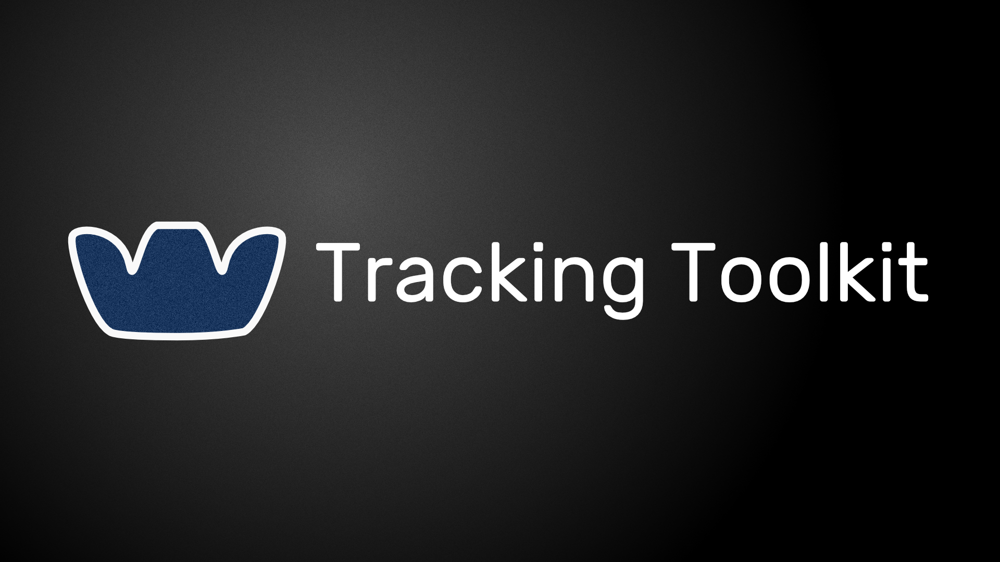
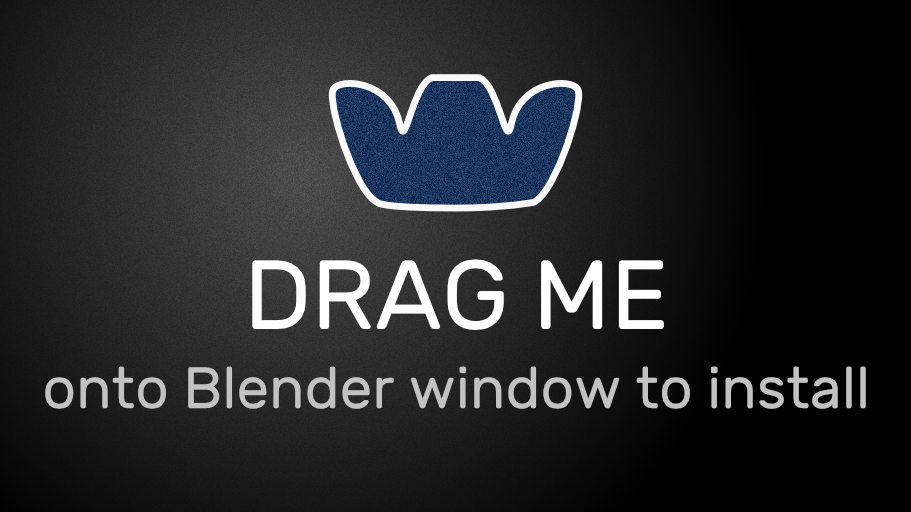
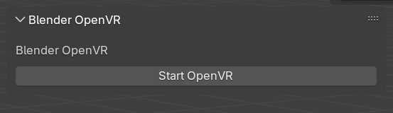
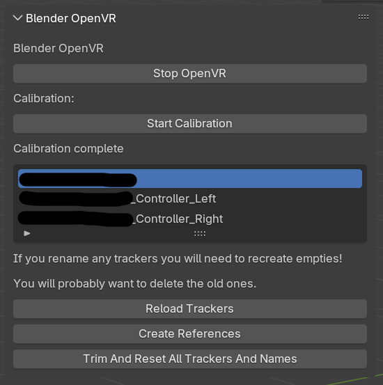
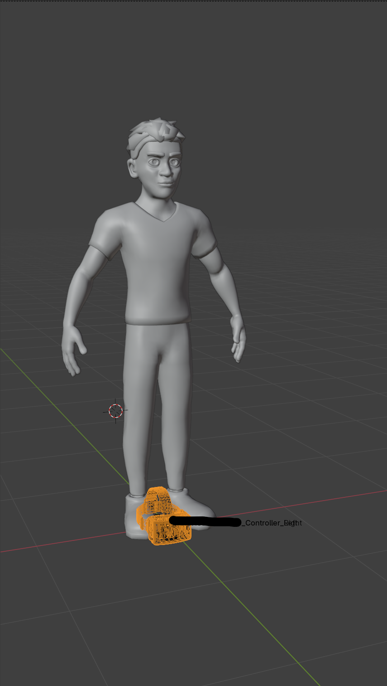
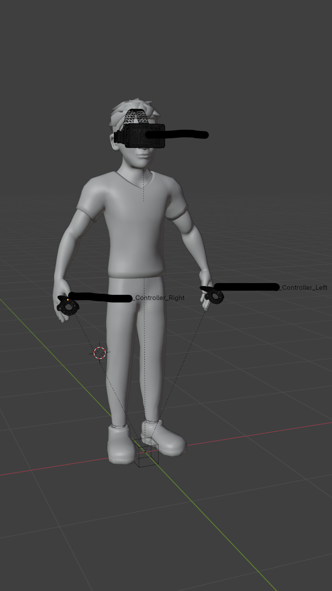
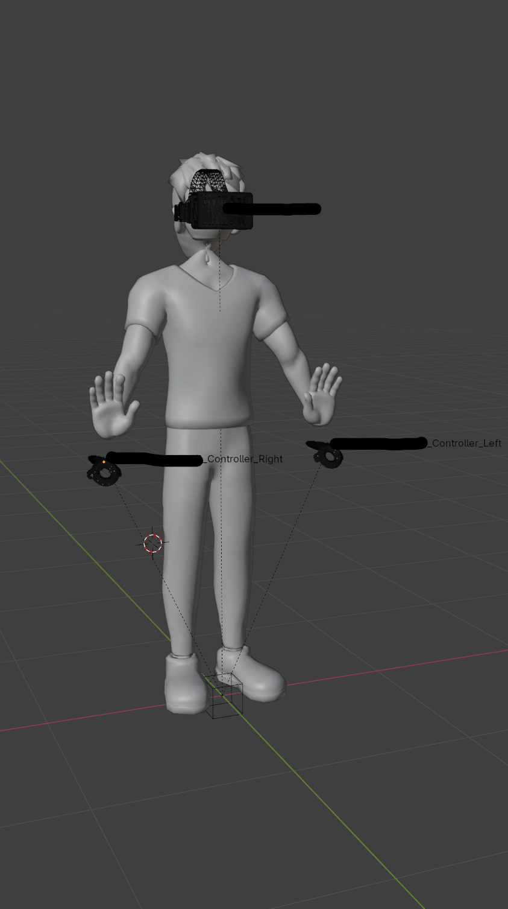
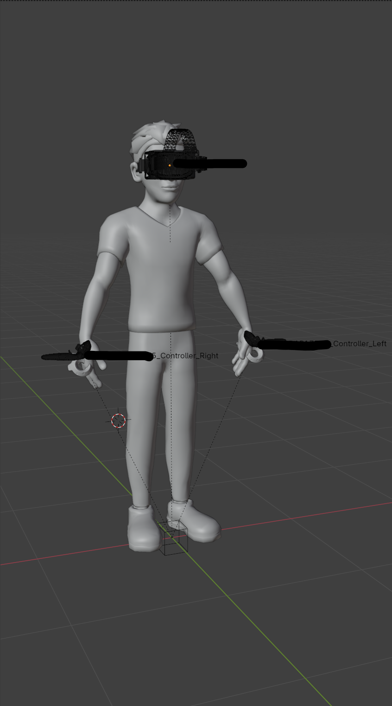
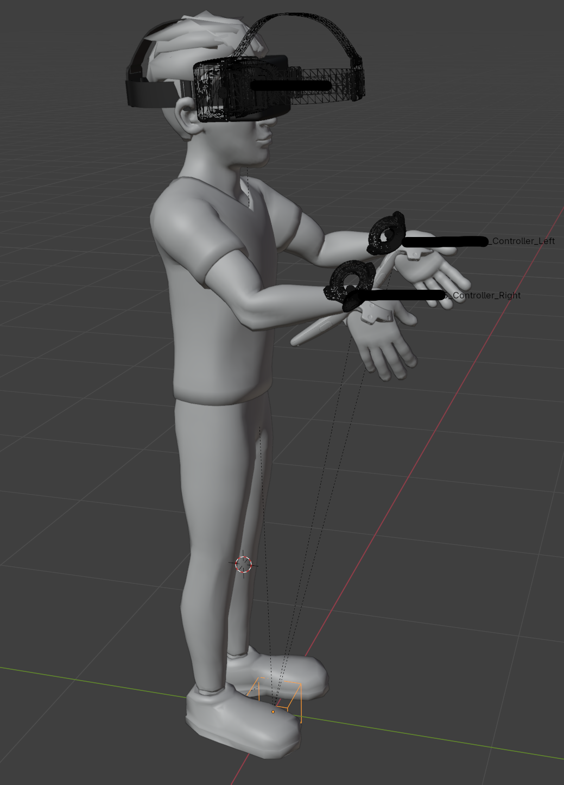

# Tracking Toolkit



## Installation

### Automatic

Drag this image onto the Blender interface. If it asks to create a repo, accept, and you may have to drag the image again. 

If you are updating, you can drag the image or check for updates in the Blender preferences.

[](https://github.com/ethanporcaro/tracking-toolkit/releases/latest/download/tracking_toolkit-latest.zip?repository=https%3A%2F%2Fraw.githubusercontent.com%2Fethanporcaro%2Ftracking-toolkit%2Frefs%2Fheads%2Fmain%2Findex.json&blender_version_min=4.2.0&platforms=windows-x64%2clinux-x64)

### Manual

1) Download `tracking_toolkit-latest.zip` from the [latest release](https://github.com/ethanporcaro/tracking-toolkit/releases/latest)
2) Open Blender, use `Edit > Preferences > Get Extensions > (Arrow in top right corner) > Install from disk`, and select the downloaded zip.

## Setup

After enabling the extension, you will find a new panel in the sidebar tabs.

Begin by clicking the `Start OpenVR` button. This will open SteamVR if it isn't open already, but I find less issues if I open it manually beforehand.

[](images/step1.png)

Then you should see the trackers populated in the dropdown. The rest of the menu will also appear.

[](images/step2.png)

***Note, this image may be outdated. The UI changes often.***

### Create References

This will create pairs of objects for each tracked device. 

* One is the 'target'. The 'target' will track exactly to the provided data from OpenVR. Any movements of it will be reset.
* The other is the 'joint'. The 'joint' is child of the 'target' and can be offset to correct alignment issues. See the calibration instructions.

This operation is generally undo-able, but be careful nonetheless.

## Calibration

There are two stages to the calibration. They can be cycled through with the `Start Calibration` button (its label will change depending on the stage).

### Stage 1: Controller Alignment

In the first step, you need to move the target (opaque) models to where the character would be holding them:

[](images/calibration1.png)
[](images/calibration2.png)


### Stage 2: Offset Correction

In some rigs, the controls have weird transforms that make constraints behave weirdly.

You can move the joint (wireframe) models until the character's pose matches the rest pose. (This may eventually be automatic)

I find usually the rotations are in increments of 90 or 180 degrees.

[](images/calibration3.png)
[](images/calibration4.png)

Then you can press the `Complete Calibration` button.

[](images/calibration5.png)

Note that I already set up constraints in this image. You may need to make a few more adjustments. 

**Even if you aren't in calibration mode, you can still move the joint (wireframe) models to fix offsets.**

### Scale issues

You can scale the `OVR Root` empty to fix most scale issues. Location and Rotation are not yet supported.

## Usage

You can press the `Start Recording` button to start writing keyframes to the object. It will clear the existing ones for the current action!

The data is recorded in sub-frames and won't necessarily match your framerate. It is saved as fast as OpenVR provides it. The viewport will max out at 60fps, but the data is recorded and applied at OpenVR's precision.

When you press the space bar, the realtime tracking will temporarily pause and the recorded take will play.

It is encouraged to save each successful take to an NLA track, so it doesn't get overwritten.


## Binding bones

You can use the `Default Armature`, `Override Armature`, and `Bound Bone` property fields to bind bones to trackers:

* `Default Armature` is the main armature the bones are a part of. You will set this to the armature you want to control.

* `Override Armature` is a per-tracker armature that can be set when you want to control multiple armatures at the same time. Usually, you will leave this blank.

* `Bound Bone` is the bone you want to bind the tracker joint to. This will add a `Copy Transforms` constraint.

Do not rename the crated constraint, otherwise it will fail to remove itself when you select a different bone.

## Troubleshooting

You will probably experience some sort of issue as this extension is being refined.

Usually, reloading the trackers will solve the issue. You may sometimes need to reset them. Those usually happen when a new device is connected.

Sometimes, stopping and starting OpenVR with the first button will solve some things.

If in doubt, open up the console window with `Window > Toggle System Console` and open an issue on GitHub with any error messages and context.

**If your steam installation is in a different directory than `C:/Program Files (x86)/Steam/steamapps/common/SteamVR`, you will need to manually set the path in the addon preferences.**

## Probably Common Questions

Q: Can I offset location and rotation?

A: Not yet. Very soon, probably. For now, it's just scale.

Q: Will other controller models show besides the generic HMD, OG Vive Controller, And Vive Tracker 3.0? What about Oculus Controllers?

A: Not currently. This may be implemented in the future.

Q: Will my scene animations play during recording?

A: No. That may change in the future if needed.

## Credits
**Huge** credits to [shteeve](https://blenderartists.org/u/shteeve) and [toyxyz](https://blenderartists.org/u/toyxyz) at [blenderartists.org](https://blenderartists.org/) for the [research and basis of this extension](https://blenderartists.org/t/openvr-tracker-streaming/1236428).

This code was rewritten by me, but shares many design choices, naming, etc. from their prototypes.

Because the [Blender Extensions](https://extensions.blender.org/) platform [requires GPL licenses](https://docs.blender.org/manual/en/latest/advanced/extensions/licenses.html) for code, and since the actual code in this repo is written by me, I feel I have the right to licence this repo under the [GPL 3.0 or later](https://spdx.org/licenses/GPL-3.0-or-later.html).

That isn't to say that the aforementioned developers had a **huge** impact on this project, as well as other users in the thread.

## License

This extension is licensed under [GPL 3.0 or later](https://spdx.org/licenses/GPL-3.0-or-later.html).

Logos and images under `/images` are in the [Public Domain (CC0)](https://spdx.org/licenses/CC0-1.0.html).

```text
Copyright (C) 2025 Ethan Porcaro

This program is free software: you can redistribute it and/or modify it under the terms of the GNU General Public License as published by the Free Software Foundation, either version 3 of the License, or (at your option) any later version.

This program is distributed in the hope that it will be useful, but WITHOUT ANY WARRANTY; without even the implied warranty of MERCHANTABILITY or FITNESS FOR A PARTICULAR PURPOSE. See the GNU General Public License for more details.

You should have received a copy of the GNU General Public License along with this program. If not, see <https://www.gnu.org/licenses/>.
```