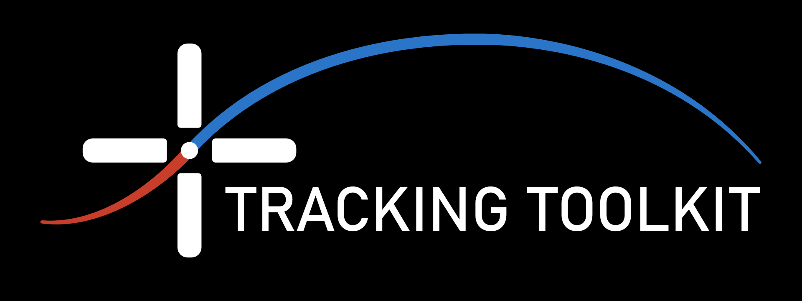
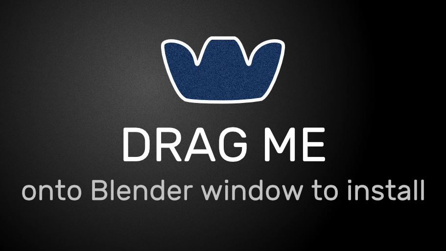
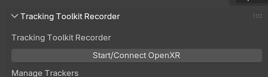
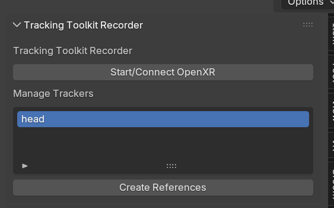

# Usage Guide

Here is a step-by-step guide for the majority of use-cases.

## Installation

Tracking Toolkit can be installed in one of two ways:

### Automatic

Drag this image onto the Blender interface. If it asks to create a repo, accept, and you may have to drag the image again. 

If you are updating, you can drag the image or check for updates in the Blender preferences.

[](https://github.com/ethanporcaro/tracking-toolkit/releases/latest/download/tracking_toolkit-latest.zip?repository=https%3A%2F%2Fgithub.com%2Fethanporcaro%2Ftracking-toolkit%2Freleases%2Flatest%2Fdownload%2Frepository.json&blender_version_min=4.2.0&platforms=windows-x64%2clinux-x64)

### Manual

1) Download `tracking_toolkit-latest.zip` from the [latest release](https://github.com/ethanporcaro/tracking-toolkit/releases/latest)
2) Open Blender, use `Edit > Preferences > Get Extensions > (Arrow in top right corner) > Install from disk`, and select the downloaded zip.

After enabling the extension, you will find a new panel in the sidebar tabs.

## Entering VR

✅ **Run these steps each time you open or restart your OpenXR runtime.**

Begin by clicking the `Start/Connect OpenXR` button. 

[](images/start-btn.png)

This will open your OpenXR runtime if it isn't open already, but I recommend opening it first.

After connecting OpenXR, you will see connected controllers and trackers show in a list. 
If these controllers are powered off or disconnected, they will be hidden until they are connected again.

[](images/tracker-list.png)

> ⚠️ If you are using Vive Trackers, you will need to use SteamVR as your OpenXR runtime. 
> You will also need to assign a role to each tracker (waist, foot, etc.) in the SteamVR tracker settings.

At this point, you are now ready to record.

## Recording Setup

✅ **Run these steps every time you open up a new Blender file.**

There are a few main buttons on the Tracking Toolkit panel:

### Create References

Pressing `Create References` will create two Blender objects for each tracked device.
Creating references is generally undo-able, but be careful when overwriting existing references.

#### Target object

The 'target' will follow the exact transformation of the OpenXR tracker. 
You should not move this object, since it will be overwritten with the tracker data.

#### Offset Object

The 'offset' is a child of the 'target' and **should be moved** instead of the 'target' if corrections need to be made to the tracker's transform.

## Recording

You can press the `Start Recording` button to start writing keyframes to the 'tracker' objects.

> 🚨 When you start a recording, your old recording will be erased.
> 
> I recommend using `File > Save Incremental` in Blender's menu each time you make a new take.

The data is recorded in subframes and won't necessarily match the framerate in Blender's Output Properties. 
Keyframe data is saved as fast as OpenXR provides it (usually the refresh rate of your VR headset). 

When OpenXR is connected, the tracker previews will max out at 60 fps in Blender's scene view. 
However, the data is saved at full precision when playing it back.

When you press the space bar, the realtime tracking will temporarily pause and the recorded take will play.


## Troubleshooting

Here are the solutions for common problems. 
Feel free to open an issue if you have additional questions or problems.

**Disconnecting and reconnecting OpenXR with the button at the top of the Tracking Toolkit will often solve minor issues.**

### Incorrect scaling

You can scale the `XR Root` empty to fix most scale issues.
Location and Rotation are overwritten when OpenXR is connected but can be adjusted after you're done with all your recording.

### FAQ

Q: Will my scene animations play during recording?

A: No. That may change in the future if needed.

# Credits
**Huge** credits to [shteeve](https://blenderartists.org/u/shteeve) and [toyxyz](https://blenderartists.org/u/toyxyz) at [blenderartists.org](https://blenderartists.org/) for the [research and basis of this extension](https://blenderartists.org/t/openvr-tracker-streaming/1236428).

This code was rewritten by me but shares many design choices, naming, etc. from their prototypes.

Because the [Blender Extensions](https://extensions.blender.org/) platform [requires GPL licenses](https://docs.blender.org/manual/en/latest/advanced/extensions/licenses.html) for code, and since I write the actual code in this repo, I feel I have the right to license this repo under the [GPL 3.0 or later](https://spdx.org/licenses/GPL-3.0-or-later.html).

That isn't to say that the aforementioned developers had a **huge** impact on this project, as well as other users in the thread.

Also, thank you to [Christopher Bruns](https://github.com/cmbruns) for the amazing [pyopenxr](https://github.com/cmbruns/pyopenxr) library.

# License

This extension is licensed under [GPL 3.0 or later](https://spdx.org/licenses/GPL-3.0-or-later.html).

Logos and images under `/images` are in the [Public Domain (CC0)](https://spdx.org/licenses/CC0-1.0.html).

```text
Copyright (C) 2026 Ethan Porcaro

This program is free software: you can redistribute it and/or modify it under the terms of the GNU General Public License as published by the Free Software Foundation, either version 3 of the License, or (at your option) any later version.

This program is distributed in the hope that it will be useful, but WITHOUT ANY WARRANTY; without even the implied warranty of MERCHANTABILITY or FITNESS FOR A PARTICULAR PURPOSE. See the GNU General Public License for more details.

You should have received a copy of the GNU General Public License along with this program. If not, see <https://www.gnu.org/licenses/>.
```

# Projects made with Tracking Toolkit

* ["Liam Right"](https://www.youtube.com/watch?v=5hOd7XADGaM&list=PLrBKkYQIF33SXziwFjMSMQx_r_6CZ_spu) by me (Ethan Porcaro)
* Yours? (Let me know!)