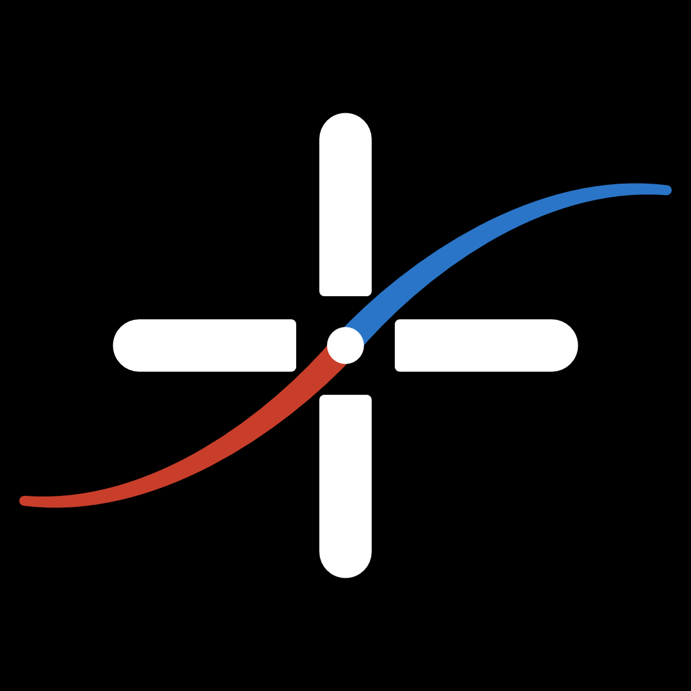
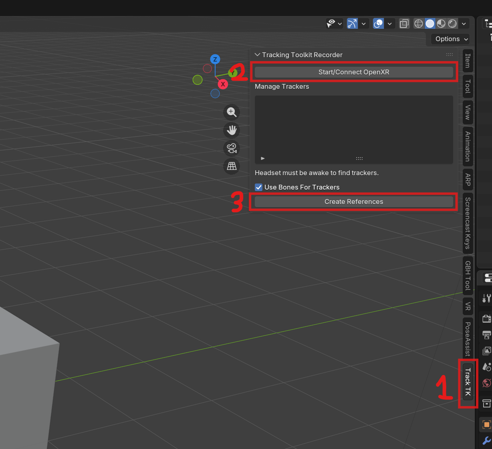
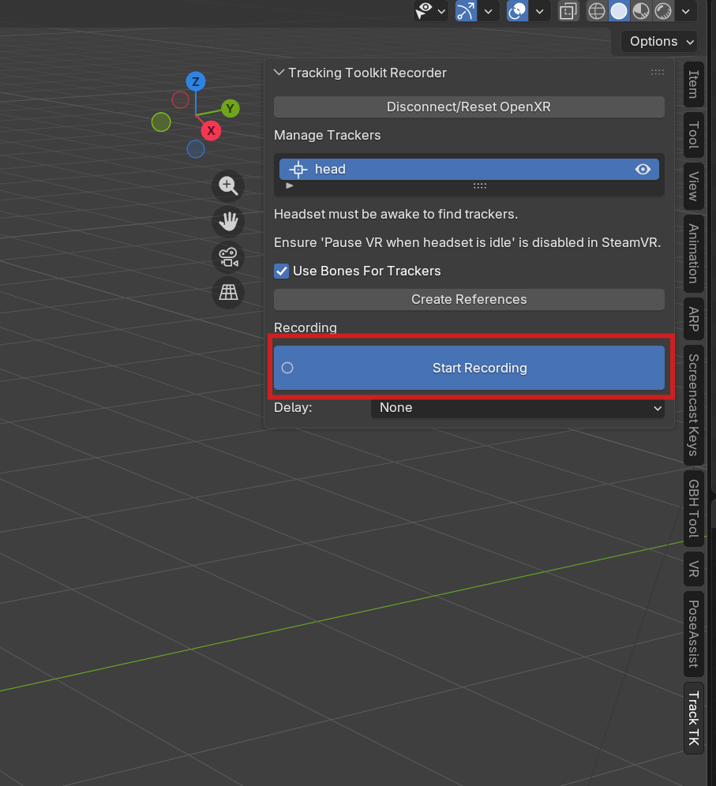

Tracking Toolkit allows you to view and record [OpenXR](https://www.khronos.org/openxr/) devices inside Blender with NLA integration and SMPTE Timestamping. 
This addon allows bones or empties to represent OpenXR device coordinates in 3D space in real time.

If you'd like to see support for a new device, let me know! You can open an issue for any questions.

## Requirements

Tracking Toolkit works with Blender 5.0 and later.

Additionally, you will need an OpenXR runtime and a device to go with it.

Example runtimes:

* SteamVR
* Meta Quest/Link
* VDXR
* Monado

Example Devices:

* Valve Index
* Meta Quest
* HTC Vive

Most XR runtimes can only be used with Vulkan as Blender's [Display Graphics Backend](https://docs.blender.org/manual/en/latest/editors/preferences/system.html#display-graphics).
If you still need to use OpenGL, your runtime will need to support headless mode.

Currently, that is limited to these runtimes:

* SteamVR
* Monado

## Installation

Tracking Toolkit can be installed in one of two ways:

### Automatic

Drag this image onto the Blender interface. If it asks to create a repo, accept, and you may have to drag the image again. 

If you are updating, you can drag the image or check for updates in the Blender preferences.

[](https://github.com/ethanporcaro/tracking-toolkit/releases/latest/download/tracking_toolkit-latest.zip?repository=https%3A%2F%2Fgithub.com%2Fethanporcaro%2Ftracking-toolkit%2Freleases%2Flatest%2Fdownload%2Frepository.json&blender_version_min=4.2.0&platforms=windows-x64%2clinux-x64)

### Manual

1) Download `tracking_toolkit-latest.zip` from the [latest release](https://github.com/ethanporcaro/tracking-toolkit/releases/latest)
2) Open Blender, use `Edit > Preferences > Get Extensions > (Arrow in top right corner) > Install from disk`, and select the downloaded zip.

After enabling the extension, you will find a new panel in the sidebar tabs.

## Usage

1) Navigate to the "Track TK" tab on the sidebar.


2) Press the `Start/Connect OpenXR` button to establish a connection to your runtime. 
If your runtime is not open, it will be launched. 
The list below will populate with names of detected controllers/trackers.


3) Press `Create References` to add the detected trackers to your scene. 
This will create bones, but you can toggle the checkbox to create empties instead.

[](images/start-btn.png)

4) At this point, a large `Start Recording` button will be visible. 
When pressed, it will record the tracker's positions until you press stop.
Existing recordings will be pushed down onto a new NLA strip and muted.

[](images/start-btn.png)

## Additional Information

### Tracker List

When new trackers are detected, they will appear on the list.
You can press `Create References` again to add them to the scene.

Even if controllers are disconnected, they will still remain on the list.

You can click the eyeball icon to show and hide the trackers in the viewport.

> ⚠️ If you are using Vive Trackers, you will need to use SteamVR as your OpenXR runtime. 
> You will also need to assign a role to each tracker (waist, foot, etc.) in the SteamVR tracker settings.

You can double click a tracker's name on the list to give it a nickname.
You should not directly rename empties or bones in the outliner.

You can also set nicknames in the addon preferences that apply to all future files.

### References

References represent your tracker in the scene.

These will either be bones in an armature, or empties. 
You can toggle `Use Bones For Trackers` checkbox at any time to change this.
Your latest recording will be transferred when switching between these.

Each tracker will have two references:

* The tracking point will follow the tracker's exact location in 3D space. 
It will have the keyframe data when recording.
Generally, it should be left untouched, as data will be overwritten when recording.


* The offset point is a child of the tracking point. 
It receives no data, and should be used for tweaking/aligning the tracker.
Objects or cameras in your scene should be constrained to this offset, rather than the tracking point.

### Recording

By default, trackers will be recorded at your scene's FPS.
You can override this in the addon preferences.

High FPS values may cause performance issues, or prevent the recording from reflecting true tracker positions.

There is a dropdown below the record button that allows you to set a delay before data is captured.

Each time you record a new take, old ones are pushed down onto new NLA strips and muted.
The action's name will be a [SMPTE timecode](https://en.wikipedia.org/wiki/SMPTE_timecode]) 
(prefixed with the tracker's name if using empties).

## Troubleshooting

Here are the solutions for common problems. 
Feel free to open an issue if you have additional questions or problems.

**Disconnecting and reconnecting OpenXR with the button at the top of the Tracking Toolkit will often solve minor issues.**

### Incorrect scaling

You can scale the `XR Root` empty to fix most scale issues.
Location and Rotation are overwritten when OpenXR is connected but can be adjusted after you're done with all your recording.

### FAQ

**Q:** How many trackers do I need?

**A:** You only need 1 to get started, but you'll need more for things like full-body motion capture.

**Q:** Can I view my scene in VR?

**A:** No. There are technical limitations that would make this difficult, and there's no current plan to support it.

**Q:** Can I only use Vive Trackers without a headset?

**A:** Yes! Make sure to disable `Pause VR when headset is idle` in the SteamVR video settings. 
If you have no headset attached at all, you may need to enable the Mock HMD driver.

**Q:** Will my scene animations play during recording?

**A:** No. That may change in the future if needed.

# Credits

Developed and maintained by Ethan Porcaro.

JRK helped the project significantly through his work as a Tech Art & PM.

Shout out to [shteeve](https://blenderartists.org/u/shteeve) and [toyxyz](https://blenderartists.org/u/toyxyz) at [blenderartists.org](https://blenderartists.org/) for [researching the extension's idea](https://blenderartists.org/t/openvr-tracker-streaming/1236428).

Also, thank you to [Christopher Bruns](https://github.com/cmbruns) for the amazing [pyopenxr](https://github.com/cmbruns/pyopenxr) library.

# License

This extension is licensed under [GPL 3.0 or later](https://spdx.org/licenses/GPL-3.0-or-later.html).

Files under `/images` and `/assets` are in the [Public Domain (CC0)](https://spdx.org/licenses/CC0-1.0.html).

Branding files are public domain, but trademark rights are reserved.

```text
Copyright (C) 2026 Ethan Porcaro

This program is free software: you can redistribute it and/or modify it under the terms of the GNU General Public License as published by the Free Software Foundation, either version 3 of the License, or (at your option) any later version.

This program is distributed in the hope that it will be useful, but WITHOUT ANY WARRANTY; without even the implied warranty of MERCHANTABILITY or FITNESS FOR A PARTICULAR PURPOSE. See the GNU General Public License for more details.

You should have received a copy of the GNU General Public License along with this program. If not, see <https://www.gnu.org/licenses/>.
```

# Projects using Tracking Toolkit

* ["Liam Right"](https://www.youtube.com/watch?v=5hOd7XADGaM&list=PLrBKkYQIF33SXziwFjMSMQx_r_6CZ_spu) by Ethan Porcaro
* Yours? (Let me know!)

# Contributions

Tracking Toolkit will always remain free.

Contributions, both in development and monetary form, are welcome.

If you want to add code, see DEVELOPMENT.md.

I have both [Ko-fi](https://ko-fi.com/varrett) and [Patreon](https://www.patreon.com/c/Varrett) pages for donations.